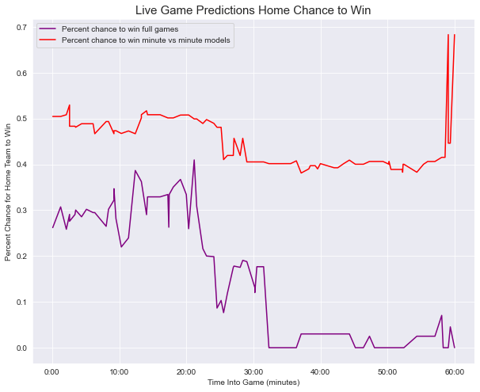

# GA_capstone
### Problem Statement:
As the world of sports analytics grows, more and more types of statistics are amassed. Being able to use those statistics in a meaningful way can provide insight and is a good use of the rich amount of information available. Being able to predict the outcome of a game using collected statistics reliably could have big impacts on not only sports analytics, but also accessory industries such as sports betting or fantasy sports. The goal of this project is to build a reliable predictor of live NHL games, on a minute to minute basis. 

#### about this repo:
There are several notebooks in this repo, but the main two are live scrape notebook, which when ran during a live game, as long as the game ID is set right in the first part of the notebook will live scrape an active game. The Model results data frame notebook can be run at the same time as the scrape, as long as the numbers for the exported CSVs are updated to the real time numbers. The final csv will have all pulls together for the whole game. Using the model evaluation and graphs notebook you can then see the full results of the game visualized, or the partial results if the game is not over yet. Please note the live scrapping process is still a work in progress, and needs a lot of work to become better automated and possibly eliminate the model results notebook all together. The data scrapping notebook has all the data aquisition, and the data wrangling notebook has all the code that got the data into the right shape and with the right variables. 

### Data Dictionary

| Feature               | Description                                                                                                                          | Unit       |
|-----------------------|--------------------------------------------------------------------------------------------------------------------------------------|------------|
| Shots                 | Shots on goal in the NHL are a puck directed intentionally at the net that must be saved by the goalie or else they would score.     | count      |
| Blocked Shots         | Shots that could be assumed to have gone on, or near net, that are blocked by a defensive player.                                    | count      |
| Penalty Minutes       | The number of minutes of penalties assigned to a team during a game. (2 minutes for minors, 5 minutes for majors)                    | minutes    |
| Power Play Percentage | The percentage of changes a team scores while on the power play (other team has a player serving a penalty).                         | percentage |
| Power Play Goals      | The number of goals scored by a team on the power play.                                                                              | count      |
| Power Play Chances    | The number of times a team is put on the man advantage by a player from the opposing team serving a penalty.                         | count      |
| Faceoff Percent       | The percent of faceoffs won by a team.                                                                                               | percent    |
| Takeaways             | The number of times a player from a team takes over possession from the opposing team.                                               | count      |
| Giveaways             | The number of unforced possession changes committed by a team.                                                                       | count      |
| Ice Tilt              | A created column totaling the aggregate ice location of events, positive numbers represent home attacking zone.                      | int        |
| Missed Shot           | A shot attempt towards goal, that does not hit the goal without being interfered with by the opposing side.                          | count      |
| hits                  | The number of times a player of the team uses his body to separate an opposing player from the puck (subjective based on home team). | count      |

### Background Research:
Using in game statistics can be a strong predictor of who will win a game, sometimes. There is always a chance for a single player to make highlight plays or have a statistics defying game. Particularly in the NHL there can be games where a goalie will have an outstanding performance, and the team that dominated in every statistical measure will still lose. addiotionally, small bursts of momentum can have major effects on the outcome of a game, but may not show up in the collected statistics. Examples of this are crowd noise effects or impressive plays that don't end up being recorded as a statistic. However people have had success modeling sports games before, and a minute by minute model, even if it is not 100% accurate, will still be able to provide key insights. 

### Approach:
In order to not train on full game stats, I took the difference for each games stat lines in favor of the home team, so the model could predict whether the home team will win or lose, based off of the differential in the stats. 
This model could not be trained using goal differences, because obviously if the goal difference is positive: win, otherwise: lose.
In order to use goals in the model, I took the difference in stats for every two minute interval, and trained 30 models, one for each two minute interval in the game. That way the model would be using similar statistical amounts to the real game state at that time. 

### Evidence and Analysis:

As we can see, on the live scrape game predictions both models were able to respond to in game events and predict the chance for the home team to win. The minute by minute modeling was much harsher on the Tampa Bay Lighting than the end game boxscores models. Both models had relatively good accuracy, especially when it got to be towards the end of the game. The main box score model believes more in the home teams chance to win a game, however the minute over minute model seems firm in its belief. The minute over minute model seems like the most likely model to accurately predict the game result, however it fails to predict well in the begining of the game. The minute over minute model also seems less likely to be susceptible to late game charges, as long as the score doesnt change. Finding a way to make both models more reliable in the early game, and less dependant on goals in the late game seems like a logical next step. 

### Conclusions and Recommendations:
The minute by minute model does seem to have a good chance of predicting the winner of game, especially later on in the game (as expected). There needs to be improvement in the model being able to predict the result of a game early on, the predictor is often wrong early in the game. The full game stats predictor also shows promise but needs tuning in order to be more resistant to non-statistics related events.

There seems to be a lot of promise in the live game predictor. There is a lot of room for it to grow and become even stronger at determining the game state. The model can also be improved with pre-game stats and and team based trends in order to make it even more reliable of a predictor. Moving forwards with strengthening the predictor and increasing its useability seem like the next steps in the process. 